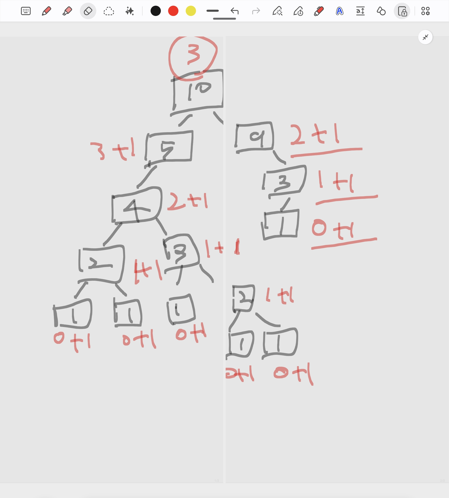

**📅 작성일**: 2025-12-28

## 🔗 문제 링크

[백준 12852번 - 1로 만들기 2](https://www.acmicpc.net/problem/12852)

**난이도**: Gold 5

---

## 🤔 접근법



정수 N에 대해 3가지 연산을 사용하여 1로 만들 때, 최소 연산 횟수와 그 경로를 구하는 문제이다.

사용 가능한 연산:
- N이 3으로 나누어떨어지면, 3으로 나눔
- N이 2로 나누어떨어지면, 2로 나눔
- 1을 뺌

핵심은 **동적 계획법(DP)을 사용하여 각 숫자까지의 최소 연산 횟수를 저장**하고, **역추적으로 경로를 출력**하는 것!

이 문제는 **Bottom-up(반복문 + 메모이제이션)** 또는 **Top-down(재귀 + 메모이제이션)** 두 가지 방식으로 풀 수 있다.

※ 하지만, 이 문제는 바텀업 방식이 시간과 메모리 측면에서 더 효율적이다.

---

## 💡 정답 풀이 방법

### 🔑 방법 1: Bottom-up DP (Answer(정답_바텀업).cpp.txt)

**알고리즘**: 반복문 기반 동적 계획법

**핵심 아이디어**:
```
1. dp[1] = 0으로 초기화 (1은 이미 1이므로 0번 연산)

2. i = 1부터 n까지 순회하며 dp 배열 채우기:
   - i가 3으로 나누어떨어지면: dp[i] = min(dp[i], dp[i/3] + 1)
   - i가 2로 나누어떨어지면: dp[i] = min(dp[i], dp[i/2] + 1)
   - 무조건: dp[i] = min(dp[i], dp[i-1] + 1)

3. dp[n] 출력 (최소 연산 횟수)

4. 역추적으로 경로 출력:
   - n부터 시작하여 dp[here] == dp[here/3] + 1인지 체크 (3으로 나눈 경로)
   - dp[here] == dp[here/2] + 1인지 체크 (2로 나눈 경로)
   - dp[here] == dp[here-1] + 1인지 체크 (1을 뺀 경로)
```

**시간 복잡도**: O(N)
- N = 입력 값 (최대 1,000,000)
- 반복문으로 1부터 N까지 순회
- 각 i마다 상수 시간 연산

**공간 복잡도**: O(N)
- dp 배열: O(N)

---

### 🔑 방법 2: Top-down DP (Answer(정답_탑다운).cpp.txt)

**알고리즘**: 재귀 + 메모이제이션 기반 동적 계획법

**핵심 아이디어**:
```
1. Go(n)을 호출하여 n을 1로 만드는 최소 연산 횟수 계산

2. Go(here) 함수:
   - Base case: here == 1이면 0 반환 (dp[1]에도 저장)
   - 메모이제이션: dp[here]에 값이 있으면 바로 반환
   - 재귀:
     * here % 3 == 0이면: min(ret, Go(here/3) + 1)
     * here % 2 == 0이면: min(ret, Go(here/2) + 1)
     * 무조건: min(ret, Go(here-1) + 1)
   - 최솟값을 dp[here]에 저장 후 반환
   
3. PrintPath(n)으로 역추적 경로 출력
```

**시간 복잡도**: O(N)
- 각 숫자는 한 번만 계산됨 (메모이제이션)
- 재귀 호출 최대 N번

**공간 복잡도**: O(N)
- dp 배열: O(N)
- 재귀 스택: 최대 O(log N) ~ O(N) (최악의 경우 -1 연산만 사용)

---

## 📊 두 방식 비교

| 항목 | Bottom-up (반복문) | Top-down (재귀) |
|-----|-------------------|----------------|
| **메모리** | **5928 KB** ⭐ | 21432 KB |
| **시간** | **4 MS** ⭐ | 24 MS |
| **방식** | 1 → N 순서대로 계산 | N → 1 재귀적으로 계산 |
| **함수 오버헤드** | 없음 ✅ | 재귀 호출 오버헤드 |
| **캐시 효율** | 높음 (순차 접근) | 낮음 (랜덤 접근) |
| **스택 오버플로우** | 없음 ✅ | 가능성 있음 (N이 매우 큰 경우) |
| **직관성** | 구현 직관적 | 문제 사고방식에 가까움 |

**✅ 결론: 이 문제는 Bottom-up 방식이 더 효율적!**

**이유:**
1. **메모리 효율**: Bottom-up은 5928KB, Top-down은 21432KB (약 3.6배 차이)
2. **시간 효율**: Bottom-up은 4MS, Top-down은 24MS (약 6배 차이)
3. **함수 오버헤드 없음**: 반복문만 사용하므로 함수 호출 비용 없음
4. **캐시 효율**: 순차적으로 메모리 접근하므로 CPU 캐시 hit율 높음

---

## 🔑 핵심 포인트

### 1️⃣ Bottom-up DP 배열 갱신 과정 (n = 10 예시)

**초기화**:
```
dp[1] = 0  (1을 1로 만드는 연산 횟수는 0)
나머지는 모두 INF (987654321)
```

**진행 과정**:

```
i = 1:
  - dp[1] = 0 (이미 초기화됨)

i = 2:
  - 2 % 3 != 0 → 스킵
  - 2 % 2 == 0 → dp[2] = min(dp[1] + 1, INF) = 1
  - dp[2] = min(dp[1] + 1, 1) = 1
  → dp[2] = 1  (경로: 2 → 1)

i = 3:
  - 3 % 3 == 0 → dp[3] = min(dp[1] + 1, INF) = 1
  - 3 % 2 != 0 → 스킵
  - dp[3] = min(dp[2] + 1, 1) = min(2, 1) = 1
  → dp[3] = 1  (경로: 3 → 1)

i = 4:
  - 4 % 3 != 0 → 스킵
  - 4 % 2 == 0 → dp[4] = min(dp[2] + 1, INF) = 2
  - dp[4] = min(dp[3] + 1, 2) = 2
  → dp[4] = 2  (경로: 4 → 2 → 1)

i = 5:
  - 5 % 3 != 0 → 스킵
  - 5 % 2 != 0 → 스킵
  - dp[5] = min(dp[4] + 1, INF) = 3
  → dp[5] = 3  (경로: 5 → 4 → 2 → 1)

i = 6:
  - 6 % 3 == 0 → dp[6] = min(dp[2] + 1, INF) = 3
  - 6 % 2 == 0 → dp[6] = min(dp[3] + 1, 3) = 2
  - dp[6] = min(dp[5] + 1, 2) = 2
  → dp[6] = 2  (경로: 6 → 3 → 1)

i = 7:
  - 7 % 3 != 0 → 스킵
  - 7 % 2 != 0 → 스킵
  - dp[7] = min(dp[6] + 1, INF) = 3
  → dp[7] = 3  (경로: 7 → 6 → 3 → 1)

i = 8:
  - 8 % 3 != 0 → 스킵
  - 8 % 2 == 0 → dp[8] = min(dp[4] + 1, INF) = 3
  - dp[8] = min(dp[7] + 1, 3) = 3
  → dp[8] = 3  (경로: 8 → 4 → 2 → 1)

i = 9:
  - 9 % 3 == 0 → dp[9] = min(dp[3] + 1, INF) = 2
  - 9 % 2 != 0 → 스킵
  - dp[9] = min(dp[8] + 1, 2) = 2
  → dp[9] = 2  (경로: 9 → 3 → 1)

i = 10:
  - 10 % 3 != 0 → 스킵
  - 10 % 2 == 0 → dp[10] = min(dp[5] + 1, INF) = 4
  - dp[10] = min(dp[9] + 1, 4) = 3
  → dp[10] = 3  (경로: 10 → 9 → 3 → 1)
```

**최종 dp 배열 상태 (1~10)**:
```
dp[1]  = 0
dp[2]  = 1
dp[3]  = 1
dp[4]  = 2
dp[5]  = 3
dp[6]  = 2
dp[7]  = 3
dp[8]  = 3
dp[9]  = 2
dp[10] = 3
```

**출력**: `3` (최소 연산 횟수)
**경로**: `10 9 3 1`

---

### 2️⃣ Top-down 재귀 트리 (n = 10 예시)

재귀 트리 진행 다이어그램은 별도 이미지 파일 참고!

---

### 3️⃣ 역추적(Backtracking)으로 경로 출력

```cpp
void PrintPath(int here)
{
    if (here == 0) return;

    cout << here << " ";

    // 3으로 나눈 경로
    if      (here % 3 == 0 && dp[here] == (dp[here / 3] + 1))
        PrintPath(here / 3);
    // 2로 나눈 경로
    else if (here % 2 == 0 && dp[here] == (dp[here / 2] + 1))
        PrintPath(here / 2);
    // 1을 뺀 경로
    else if (here - 1 >= 0 && dp[here] == (dp[here - 1] + 1))
        PrintPath(here - 1);
}
```

**✅ 핵심**:
- DP 배열에 이미 최소 연산 횟수가 저장되어 있음
- `dp[here] == dp[next] + 1`을 만족하는 경로가 최단 경로
- 조건을 만족하는 경로로 재귀 호출

**우선순위**:
- 3으로 나누기 → 2로 나누기 → 1 빼기 순서로 체크
- if-else if 구조로 첫 번째 조건만 선택 (어차피 최솟값은 동일)

---

### 4️⃣ fill_n으로 배열 초기화

```cpp
fill_n(dp, 1000004, INF);
```

**✅ 핵심**:
- `fill_n(시작 포인터, 개수, 값)` 형태
- for문보다 간결하고 빠름
- STL 알고리즘 사용 권장

---

### 5️⃣ 참조 변수로 메모이제이션

```cpp
int& ret = dp[here];  // 참조 변수
if (ret != INF) return ret;  // 이미 계산됨
```

**✅ 핵심**:
- `int&`로 dp[here]의 참조 획득
- ret에 값을 대입하면 dp[here]도 자동으로 갱신됨
- 코드 간결성 향상

---

## ⏱️ 시간복잡도

**O(N)**
- N = 입력 값 (최대 1,000,000)
- Bottom-up: 반복문으로 1~N 순회
- Top-down: 메모이제이션으로 각 숫자 한 번씩만 계산
- 매우 빠른 알고리즘

---

## 💾 공간복잡도

**O(N)**
- `dp[1000004]`: 최소 연산 횟수 저장 배열
- Bottom-up: 스택 사용 없음
- Top-down: 재귀 스택 추가 사용 (최악 O(N))

---

## 🚨 주의사항

1. **dp[1] 초기화**: Bottom-up은 `dp[1] = 0`으로 명시적 초기화 필요
2. **Base case 저장**: Top-down은 `return dp[1] = 0`으로 dp 배열에도 저장해야 역추적 가능
3. **역추적 종료 조건**: `if (here == 0) return;`으로 0에 도달 시 종료
4. **3가지 경우 모두 체크**: 최솟값을 놓칠 수 있으므로 모든 연산 확인 필수
5. **우선순위 설정**: 역추적 시 if-else if로 하나의 경로만 선택
